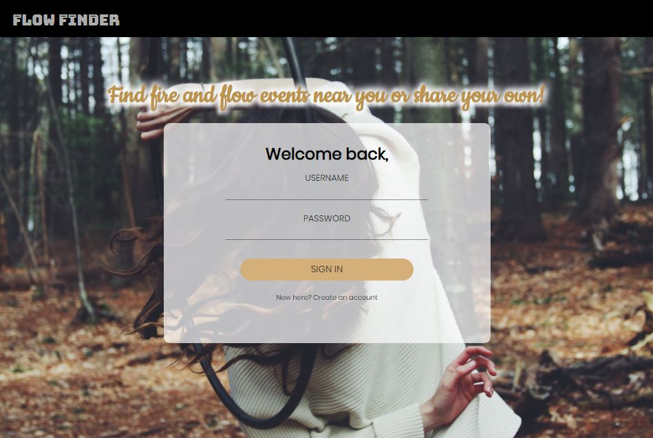
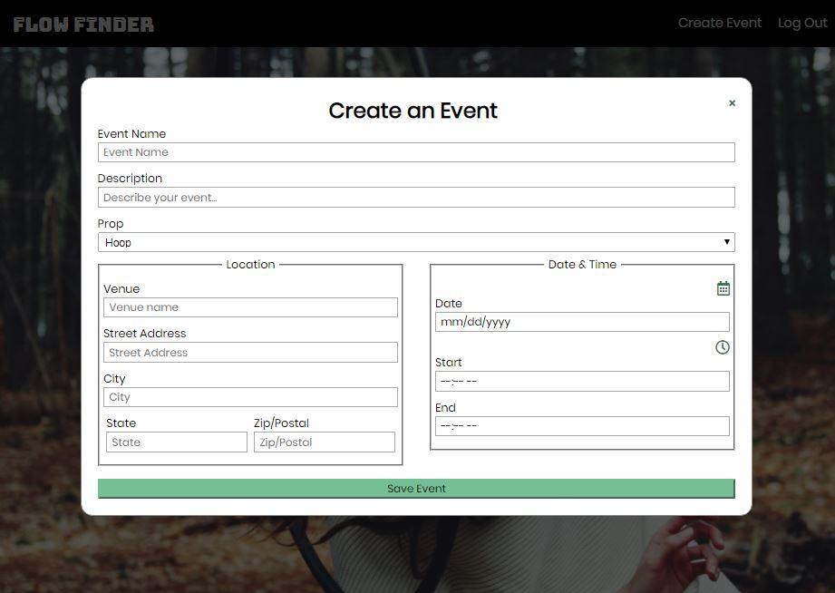
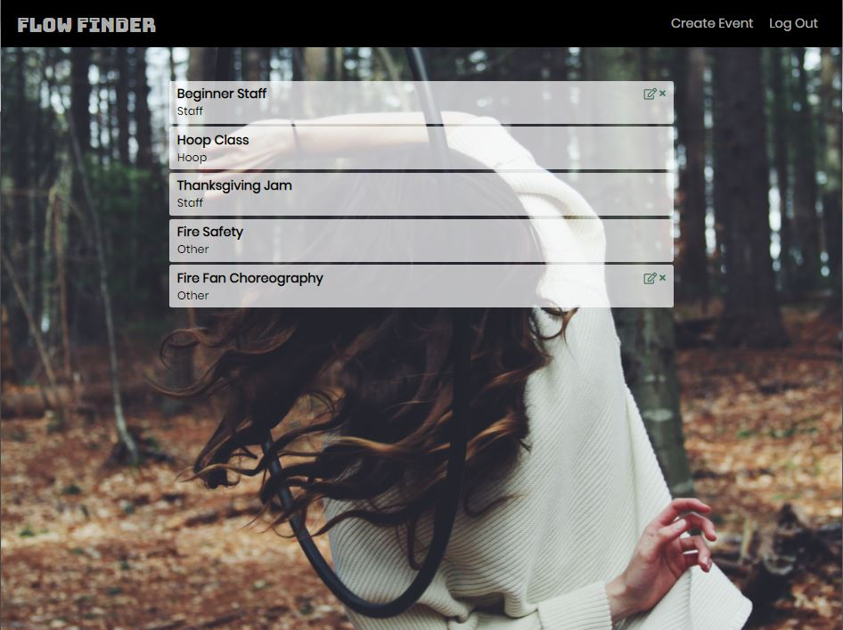

# Flow Finder

**Table of Contents**

1. [Introduction](#introduction)
2. [Technologies Used](#technologies-used)
3. [Future Implementations](#future-implementations)

**Live Demo:** [Flow Finder](https://flow-finder-2.herokuapp.com)
-- Demo Account --
username: demo
password: password123

## Introduction
Flow Finder allows flow artists to share events related to flow props such as hoop, staff, poi, fans, etc. Find where you can light up safely or bring out your LED toys at night. Let others know if you're hosting a workshop, class, or performing at a festival!

## Technologies Used
* Node.js
* Express
* MongoDB
* Mongoose
* PassportJS
* JSON Web Token (JWT) Authentication
* HTML
* CSS
* JavaScript
* jQuery

## Future Implementations
* Saving events to User's profile
* User profile
* Search and filter function
* Google Places API